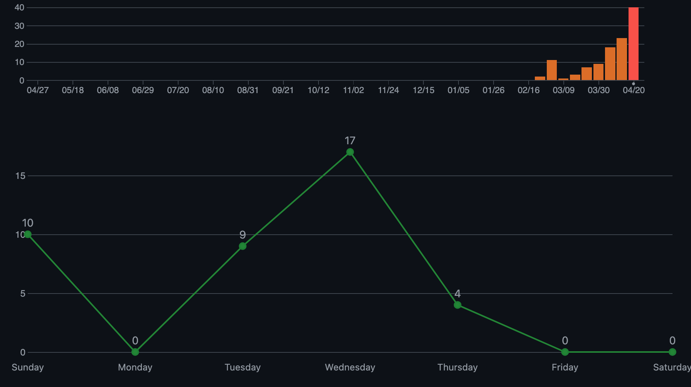

# Documentation of CircuitForge

## Struktur

Typ: JSON API x Vue.js Frontend

- Datenbank export: [schema.sql](datamodel/schema.sql)

- Frontend: `project/frontend/`
- Backend: `project/api/`

## Pre-Sprint 1: Projektantrag

[Projektantrag](projektantrag.md)

## Pre-Sprint 2: Figma Prototyp

Figma: https://www.figma.com/design/My7Y1fsFgrsLZDAbdR15ZG/CircuitForge?node-id=0-1&t=yzkKsVEjpbKWpXnm-1

Farben/Fonts: [Design.md](sysspec/frontend/design.md)

## Sprint 1: Projektinitialisierung

03.04.2025

**Frontend**

- Erstellung des Vue Projekts.
- Implementiert
  - Navigationsleiste
  - PostCard
- Projektstruktur
  - .htaccess files für redirects

**Ziele für Sprint 2**

- Login Management (Front- & Backend)
- text Editor auswählen und probieren
- Laravel projekt

## Sprint 2: Login Management

[TipTap Editor Spec](sysspec/tiptap.md)

**Login System**

- **Registrierung**
  - Form Validierung
  - username
  - email
  - password
  - confirm password

- **Anmeldung**
  - login: username oder email
  - password

- **Social Login**
  - Anmeldung und managen von social logins
  - Twitch
  - Discord
  - GitHub
  - Google

**Ziele für Sprint 3**

- Post erstellung/view
- 3D Rendering der Schematics

## Sprint 3: create/view Post

**Posts**

- **Post erstellen**
  - Titel
  - Versionssuche
  - hashtags
  - images
  - assets
- **Posts ansehen**
  - post liken
  - assets herunterladen

