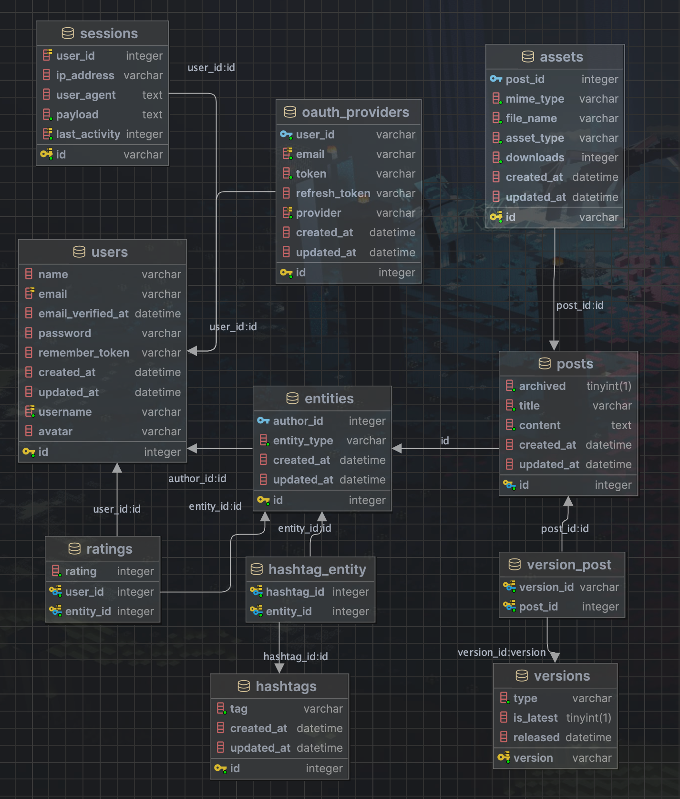

CircuitForge
---
<!-- jump_to_middle -->
<!-- alignment: center -->

Eine Platform für das Teilen von Redstone-Technik und -Kreationen in
Form vom Posts.

<!-- pause -->

Posts haben Bilder, eine Beschreibung
und Downloads (Blaupausen).

<!-- end_slide -->

Datenbank
---



<!-- end_slide -->

Code Review: Asset Management
---
<!-- alignment: center -->

<!-- new_lines: 4 -->

Speicherung von File in das System.
```javascript +line_numbers
public static function makeAssetFromFile(UploadedFile $file, AssetType $type = AssetType::ASSET): self {
    if (!$file->isFile()) throw new \Error("Uploaded file is not a file");
    $savedAsset = Asset::create([
        "file_name" => $file->getClientOriginalName(),
        "asset_type" => $type,
        "downloads" => 0,
        "mime_type" => $file->getMimeType(),
    ]);
    $savedAsset->save();
    Storage::put(ASSET_PATH . $savedAsset->id, $file->get());
    return $savedAsset;
}
```

<!-- end_slide -->

Code Review: OAuth Authentication
---
<!-- alignment: center -->

Simple OAuth Weiterleitung

```javascript +line_numbers
public function addOauthRedirectHandler(OAuthProviderType $providerType) {
    return Socialite::driver($providerType->value)
        ->redirectUrl(config("services." . $providerType->value . ".redirect_add"))
        ->redirect();
}
```

<!-- pause -->

OAuth Daten an Frontend senden

```javascript +line_numbers
private function sendAuthLoginMessage(bool $success, string $error = ""): RedirectResponse {
    $response = [
        "responseType" => ApiResponseType::AUTH_LOGIN,
        "data" => [
            "success" => $success,
            "error" => $error
        ]
    ];
    $encodedResponse = base64_encode(json_encode($response));
    return redirect()->away(env('FRONTEND_URL') . "api-handler#" . $encodedResponse);
}
```

<!-- end_slide -->

Code Review: Version Seeder DB
---

<!-- new_lines: 2 -->
<!-- alignment: center -->

Datenbank wird automatisch mit allen aktuellen
Minecraft versionen befüllt

```javascript +line_numbers
$data = $this->getJsonVersions();
$versionArr = $data->versions;
// release: {latest release}
// snapshot: {latest snapshot}
$latestVersions = array_values((array)$data->latest);
DB::table('versions')->truncate();
foreach ($versionArr as $value) {
    DB::table('versions')->insert([
        "version" => $value->id,
        "released" => $value->releaseTime,
        "type" => $value->type,
        ...(in_array($value->id, $latestVersions) ? ["is_latest" => true] : []),
    ]);
}
$this->command->info("Done seeding versions!");
```

<!-- end_slide -->

<!-- alignment: center -->
<!-- new_lines: 18 -->
# Live Demo