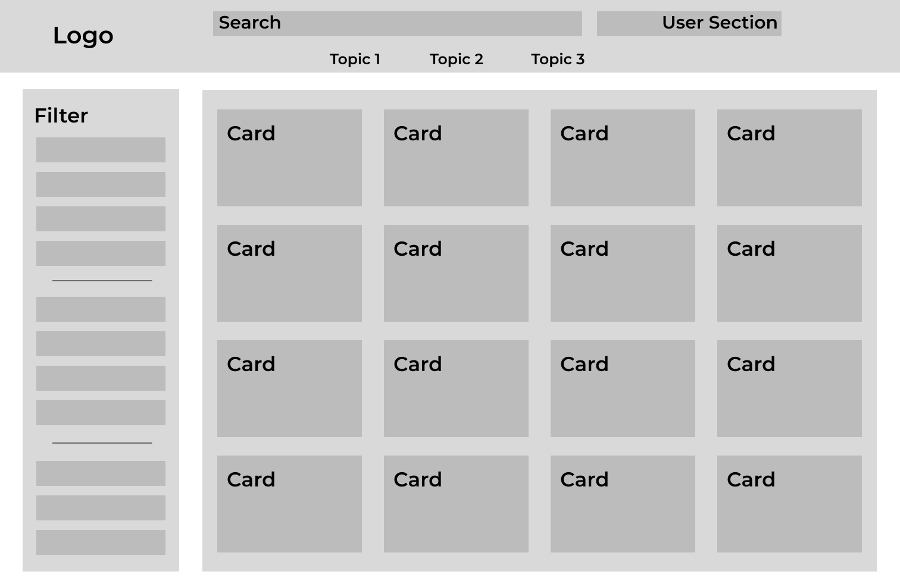

# Name: ShareStone / CircuitForge

## Definitionen

**Schematic**: Blaupause in Minecraft\
**OP**: Original Poster

## Projektbeschreibung

Eine Platform für das Teilen von Redstone-Technik und -Kreationen in
Form vom Posts.

Posts bestehen hauptsächlich aus einer
Galerie, Downloads und einer Beschreibung.

Diskussionen gibt es neben Posts. Sie enthalten keine Struktur etc. sondern
sind eine reine Diskussion über ein Thema von Redstone in Minecraft.
(Integriertes Forum)

Andere Personen können unter Posts
<opt>und Diskussionen</opt> kommentieren.

Das Kommentarsystem ist verschachtelt bis zu voraussichtlich
maximal 5 Leveln. (Baumstruktur wie bei Reddit)

### File Uploads

Schematics:

- litematic (Litematica)
- nbt (Minecraft)
- schem/schematic (WorldEdit / MCEdit)

Andere:
- world save file

## Unique Selling Point

- Zentralisiertes System für das Teilen, Verbreiten und Beibringen von
    Redstone-Technik
- Erweiterte Suchoptionen für verschiedene Anwendungsfälle
  - (Tags)
- Community-Driven:
  - Kommentare
  - Posts
  - mögliche Verbesserungsvorschläge
- Freundlich gegenüber Anfängern mit Redstone

## UI/UX

Die Website kann komplett ohne Account genutzt werden.
Will man jedoch etwas liken oder Posten muss ein Account erstellt
werden.

**Landing Page**

Die "Landing-Page" fängt direkt mit allen Posts und Diskussionen
an, einer Suchleiste, Filteroptionen etc.
Beim ersten Besuch wird ein Tour-Banner angezeigt für neue Nutzer.

Es gibt folgende Reiter im Header:

 - Posts
 - Diskussionen
 - [Logged in]
   - Profil dropdown mit settings, meine Posts, etc.
 - [Logged out]
   - Login
   - Registrieren

**Posts**

Posts haben eine Main-Sektion mit der Galerie, Beschreibung,
Downloads, etc.

Darunter sind dann die Kommentare.

**Diskussionen**

Diskussionen haben als Main-Sektion nur einen Start kommentar.
Darunter folgen dann andere Kommentare wie bei Posts.

**Editierbarer Content**

User können Editieränderungen für _einen Post_ / _eine Diskussion_ vorschlagen,
der vom OP akzeptiert werden kann.

**Markdown Styling**

Textinput in Posts, Kommentare, etc. unterstützt 
markdown Styling wie fett, kursiv, überschrift, liste, etc.

**User**

Nutzer können sich Posts, Diskussionen und Kommentare
speichern und in ihrem Profil anschauen.

### Grober Wireframe

## Coder Plan

### PHP (Backend)

**Überblick**

Ein REST-Service stellt endpoints für das Frontend bereit.
Die Filterung läuft hauptsächlich am Server ab

- Login System mit Session Management
- Posts, Kommentare, Diskussionen
- MySQL Datenbank

**Kommentare**

Posts, Diskussionsposts und Kommentare haben alle eine eigene
entity ID welche UNIQUE ist.\
Wird im Datenmodell näher erläutert.

Ein Kommentar referenziert eine solche entity ID als Parent.
So wird das Nesten einfacher und mehr modular.

**Likes/Dislikes**

Tabelle Ratings besteht aus PostID (PK,FK), UserID (PK,FK) und 
rating.
So wird sichergegangen, dass ein Nutzer nicht gleichzeitig
Liken und Disliken kann.

### Vue.js (Frontend)

**Kommentar Komponente**

Eine Kommentar Component erhält ein level und die entity ID
des Kommentars. Der Kommentar kümmert sich selbst darum, alle
Unter-Kommentare vom Server zu besorgen. (Rekursiv)

**Markdown Styling**

Markdown wird mit einer Library wie [TipTap](https://tiptap.dev/product/editor),
[Lexical](https://playground.lexical.dev/) oder ähnlichem implementiert.

## Datenmodell

**Post**

- Title
- Beschreibung
- Kategorie: CREATIVE, SURVIVAL, ...
- Schwierigkeit: EASY, MEDIUM, HARD ㅤㅤㅤ // Vielleicht anderes Rating
- Tags
- Autor
- Download Resourcen
- Likes -> List of Users
- Dislikes -> List of Users
- Kommentare
- entity ID

**Diskussion**

- Title
- Beschreibung
- Tags
- Autor
- Status: OFFEN, 
- Likes -> List of Users
- Dislikes -> List of Users
- Kommentare
- entity ID

**Kommentar**

- Autor
- Inhalt
- Likes -> List of Users
- Dislikes -> List of Users
- Parent -> entity ID
- entity ID

**User**

- user ID
- Username
- Email
- Passwort
- Profilbild
- Kommentare
- Gespeichert

