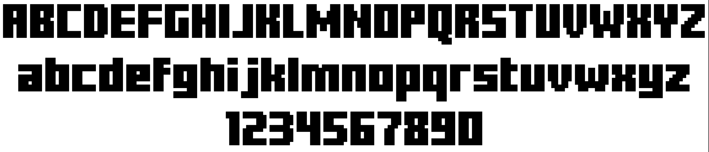
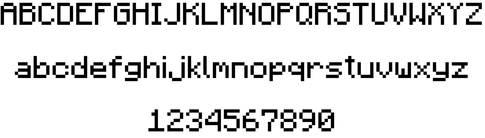
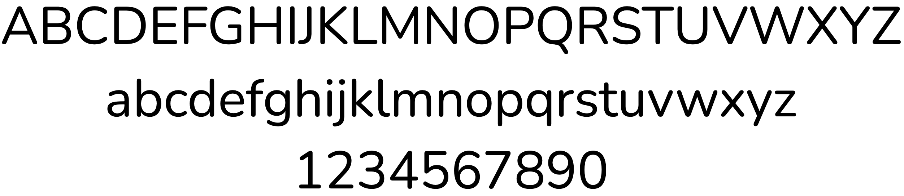

# Fonts:


## Heading: **Minecraftory**



## Special: **Minecraftia**



## Body(default): **Nunito**



# Colors:

```css
{
    --text-primary: #FFFFFF;
    --text-secondary: #D2D2D2;

    --background: #0a0406;
    --background-hover: #12060a;
    --background-active: #080305;

    --container: #212121;
    --container-hover: #292929;
    --container-active: #181818;

    --content: #2f2f31;
    --content-hover: #3a3a3c;
    --content-active: #262628;

    --primary: #950437;
    --primary-hover: #b20646;
    --primary-active: #7a032d;
    --primary-disabled: #4d021d;

    --primary-weak: #4d021d;

    --secondary: #3f623b;
    --secondary-hover: #4e7a48;
    --secondary-active: #2e462a;
    --secondary-disabled: #1f311d;

    --secondary-weak: #1f311d;

    --accent: #e52465;
    --accent-hover: #ff2e75;
    --accent-active: #b31c50;
    --accent-disabled: #731230;

    --accent-weak: #731230;

    --tier-novice: #4ba64f;
    --tier-apprentice: #d08c2d;
    --tier-engineer: #e06b27;
    --tier-mastermind: #a347b3;
    --tier-guru: #e32428;

    --success: #57c287;
    --error: #f04747;
    --warn: #f5b64b;
    --info: #479bf0;
}
```


